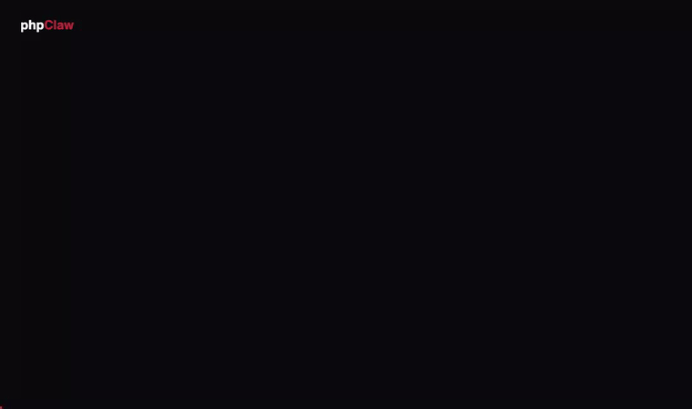

<p align="center">
    
    
</p>

<p align="center">
<a href="https://github.com/phpclaw-php/phpclaw-monorepo/actions/workflows/core.yml"></a>
<a href="https://www.php.net"></a>
<a href="LICENSE"></a>
<a href="https://packagist.org/packages/phpclaw/phpclaw"></a>
<a href="https://github.com/phpclaw-php/phpclaw-monorepo"></a>
</p>

<h1 align="center">The universal AI agent engine for PHP.</h1>
<p align="center">Tools, memory, security, and a ReAct loop, already built. Zero framework dependencies in core. Any LLM provider.</p>

<p align="center"><a href="https://phpclaw.ai/docs">Documentation</a> · <a href="#framework--cms-adapters">Adapters</a> · <a href="#why-phpclaw">Why phpClaw</a> · <a href="#first-agent-in-seconds">Install</a> · <a href="#mcp-server">MCP</a> · <a href="#security">Security</a></p>

<p align="center">
  
</p>

---

## First agent in seconds

```bash
composer require phpclaw/phpclaw
export ANTHROPIC_API_KEY="sk-ant-..."
```

```php
$agent = PhpClaw\Claw::builder()->build();
echo $agent->send('What can you help me with?')->text;
```

One env var, one builder, one `send()`. The builder checks `ANTHROPIC_API_KEY`, then `OPENAI_API_KEY`, `GROQ_API_KEY`, `GEMINI_API_KEY`, `MISTRAL_API_KEY`, `DEEPSEEK_API_KEY`, `OLLAMA_HOST`, in that order, and uses whichever it finds first. No YAML, no agent framework to learn, no vendor lock-in.

## Give your agent tools

An agent without tools can only talk. Register the ones your application needs and it starts doing real work:

```php
use PhpClaw\Claw;
use PhpClaw\Tools\ShellTool;
use PhpClaw\Tools\HttpTool;
use PhpClaw\Tools\FileReadTool;
use PhpClaw\Tools\DatabaseQueryTool;
use PhpClaw\Tools\CodeSearchTool;

$agent = Claw::builder()
    ->tools([
        new ShellTool(allowlist: ['df', 'ps', 'tail']),
        new HttpTool(),
        new FileReadTool(),
        new DatabaseQueryTool($pdo),
        new CodeSearchTool(),
    ])
    ->build();
```

```
> Check disk usage and tail the last 20 lines of the error log
> Is api.example.com responding right now?
> Run a read-only SELECT to count today's orders
> Find every place UserService is used in this codebase
```

The agent decides which tools to call and in what order, running a ReAct loop (reason, act, observe, repeat) until it has an answer or hits the iteration cap. This works identically whether the tools touch your shell, your database, your HTTP APIs, or your codebase.

## Why phpClaw

Every "AI in PHP" tutorial ends the same way: an HTTP client bolted onto a provider API, a hand-rolled tool-call loop, and a prayer that the prompt holds up in production. A generic LLM SDK gives you the API client. phpClaw gives you the agent runtime around it: the loop, the guards, the memory, the framework wiring, already assembled.

| | phpClaw | Generic LLM SDK |
|---|---|---|
| Tool-calling loop | ReAct, built in | You write it |
| Framework-native adapters | 8, idiomatic per framework | None |
| Prompt injection defence | 8 default guards + opt-in rate limiting | None |
| Memory abstraction | Swappable drivers | None |
| Streaming + tool-calls together | Hybrid mode | Varies |
| MCP server bundled | Expose any app to Claude Desktop | None |
| Zero framework deps in core | `ext-curl`, `ext-json`, `ext-mbstring`, done | Depends |
| Core license | MIT, nothing gated | Varies |

**Not trying to be everything.** phpClaw isn't built for complex RAG pipelines or multi-agent orchestration. It's built for one job: give an LLM tools, memory, and security controls against your real application, in an afternoon.

## What phpClaw provides

**Agent runtime.** A ReAct loop with a hard iteration cap (`max_iterations`, default 20), pluggable tools, pluggable memory, and keyword-matched skills, all running inside a single reasoning cycle.

**Provider flexibility.** 7 providers auto-detected from environment variables: Anthropic, OpenAI, Groq, Gemini, Mistral, DeepSeek, Ollama. A custom OpenAI-compatible endpoint is also supported, opt-in via `PHPCLAW_PROVIDER=custom`. Switch providers with `->provider()` and `->model()`, no code changes elsewhere.

**Production controls.** 8 security guards on by default (prompt injection, PII, code injection, Unicode, homoglyph, role-switch, destructive SQL, message length), plus rate limiting available as an opt-in guard. Tool results are sanitised unconditionally by `ToolOutputGuard`, which sits outside the guard registry, and LLM output sanitisation is on by default and can be disabled with `->sanitiseOutput(false)`. `ShellTool` is allowlist-only with a hard-coded command blocklist that can't be overridden. `HttpTool` validates resolved IPs, not just hostnames, closing the DNS-rebinding gap a prefix blocklist alone would miss. `FileReadTool`/`FileWriteTool` are workspace-sandboxed and refuse sensitive paths and extensions.

**Developer experience.** Token-by-token streaming, prompt caching (cached input tokens billed at Anthropic's discounted cache-read rate, see [Anthropic's pricing](https://www.anthropic.com/pricing) for the exact figure), and extended thinking (Claude's reasoning chain exposed on `$response->thinking`).

**Ecosystem.** 8 framework and CMS adapters, an MCP server for exposing your tools to Claude Desktop and Claude Code, and an optional cloud transport for a hosted, continuously-updated prompt-scan guard.

## Framework & CMS adapters

Each adapter wires phpClaw into its host's own idioms: Eloquent for Laravel, Doctrine for Symfony, WP-CLI for WordPress, Drush for Drupal, and so on. Every adapter ships an admin chat or CLI and the same 3-table memory schema underneath.

| Platform | Package | Install | Versions |
|---|---|---|---|
| Laravel | `phpclaw/phpclaw-laravel` | Composer | 10, 11, 12, 13 |
| Symfony | `phpclaw/phpclaw-symfony` | Composer | 6.4, 7.x, 8.x |
| Drupal | `phpclaw/phpclaw-drupal` | Composer | 10, 11 |
| Magento / Adobe Commerce | `phpclaw/phpclaw-magento` | Composer | 2.4.x |
| WordPress + WooCommerce | -- | ZIP upload | 6.2+ |
| Joomla | -- | ZIP upload | 4, 5, 6 |
| OpenCart | -- | ZIP upload | 3.x, 4.x |
| PrestaShop | -- | ZIP upload | 8.x, 9.x |

CMS adapters ship as ZIP downloads from [Releases](https://github.com/phpclaw-php/phpclaw-monorepo/releases), not Composer, because that's how their host platforms install extensions.

```bash
php artisan phpclaw "deploy staging and notify #ops"          # Laravel
bin/console phpclaw "check all database connections"          # Symfony
drush phpclaw:run "list recently-active users"                # Drupal
bin/magento phpclaw:run "check order-queue status"             # Magento
wp phpclaw send "summarise today's posts"                     # WordPress
php cli/joomla.php phpclaw "list recent articles"              # Joomla
php cli/phpclaw.php send "check low stock products"            # OpenCart
php modules/phpclaw/cli/phpclaw.php send "check stock levels"  # PrestaShop
```

Full per-adapter reference (tools, REST routes, CLI commands, settings, memory drivers) lives on the [doc site](https://phpclaw.ai/docs/adapters/). Each adapter's own README is a short pointer, not a manual. Building a new one? See the [community adapter guides](https://phpclaw.ai/docs/community/building-an-adapter).

## MCP Server

`phpclaw/phpclaw-mcp` exposes your existing `ToolRegistry` over the Model Context Protocol, so [Claude Desktop](https://claude.ai/download), [Claude Code](https://claude.com/claude-code), Cursor, or any MCP-compatible client can call your tools directly, with the same guard chain protecting every call. No changes to the tools themselves.

```bash
composer require phpclaw/phpclaw-mcp
```

Full quick start, transport, and security details: [phpclaw.ai/docs/mcp](https://phpclaw.ai/docs/mcp).

## Security

Every message runs through the default guard chain before it reaches the provider. `ShellTool` accepts only a caller-supplied allowlist; a fixed, non-overridable blocklist of dangerous commands is checked first regardless of what's allowlisted. `HttpTool` blocks requests by hostname prefix, then re-validates every resolved IP address, catching CGNAT and DNS-rebinding attempts that hostname checks alone would miss. `FileReadTool` and `FileWriteTool` are sandboxed to a configured workspace root and refuse credentials, keys, and framework-internal directories unconditionally.

Full guard reference, the exact `ShellTool` blocklist, and the SSRF/sandbox implementation details: [phpclaw.ai/docs/security](https://phpclaw.ai/docs/security). Found a vulnerability? See [SECURITY.md](.github/SECURITY.md), do not open a public issue.

## Architecture

```text
Message
  → Guards       (blocks injection/PII before the LLM sees it)
  → Hooks         (lifecycle events fire, 40 across the loop)
  → Agent          (ReAct loop: provider + tools + memory + skills)
  → AgentResponse  (text, tokens, tool calls, timing)
```

Providers, tools, memory, guards, and skills are all pluggable via static registries; every adapter wires them from its own config or environment. Full architecture diagram and design rules: [phpclaw.ai/docs/architecture](https://phpclaw.ai/docs/architecture).

## Extensibility

Six pluggable static registries: `ToolRegistry`, `GuardRegistry`, `HookRegistry`, `MemoryRegistry`, `ProviderRegistry`, `SkillRegistry`. Drop a class in `packages/core/src/<Subsystem>/` with the matching attribute (`#[Tool]`, `#[Provider]`, `#[Memory]`, `#[Skill]`, `#[Hook]`, `#[Guard]`), run `composer dump-autoload`, it's live. Or register from code with `->register()` on the relevant registry.

Full extension recipes with working code for every subsystem: [phpclaw.ai/docs](https://phpclaw.ai/docs).

## Testing

```bash
for pkg in core cloud mcp; do (cd packages/$pkg && composer test); done
```

**Working on `packages/core` and testing through an adapter?** Adapters consume the three libraries
as **copied** composer path repositories, not symlinks, and most composer commands will not refresh
that copy:

| Command | Delivers a core change? |
|---|---|
| `composer install` (no `vendor/` yet) | **yes** |
| `composer install` (`vendor/` already present) | **NO** |
| `composer update phpclaw/phpclaw` | **NO** |
| `composer sync-core` | **yes** |

**After editing `packages/core`, `packages/cloud` or `packages/mcp`, run `composer sync-core` in the
adapter you are testing, or you are testing a stale copy.** The first `install` succeeding is what
makes the second one dangerous: the command appears to work, so nobody suspects it later.

Unit tests use mocks and stubs for HTTP clients, `\Redis`, and the filesystem: no external network calls and no API keys are needed to run the suite for core, cloud, or mcp. Coverage requirements and the full testing rules are in [CONTRIBUTING.md](.github/CONTRIBUTING.md).

## Documentation

This README gets you installed. Everything else, architecture, the full provider/tool/guard/hook/memory/skill reference, per-adapter tool and REST tables, code examples, upgrading, troubleshooting, lives at:

**[phpclaw.ai/docs](https://phpclaw.ai/docs)**

- [CONTRIBUTING.md](.github/CONTRIBUTING.md) · [SECURITY.md](.github/SECURITY.md)

## Requirements

- **PHP:** 8.1, 8.2, 8.3, 8.4
- **Extensions:** `ext-curl`, `ext-json`, `ext-mbstring` (core only; adapters may need more, documented per-package)

## License

[MIT](LICENSE), built with love for the PHP community. Part of the [phpClaw](https://github.com/phpclaw-php/phpclaw-monorepo) project.
