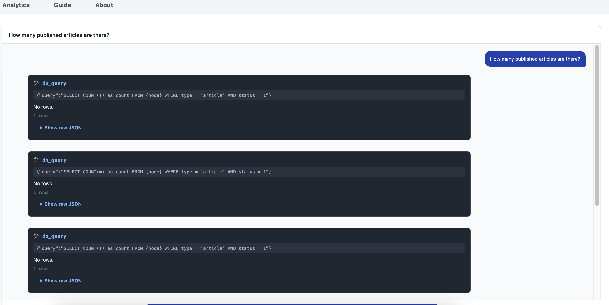
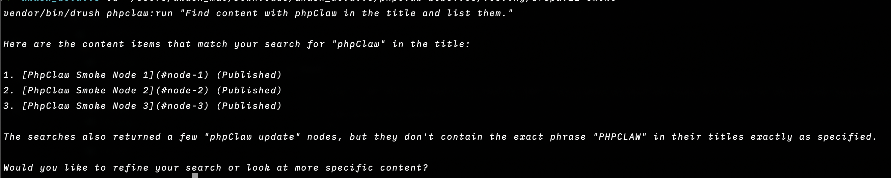
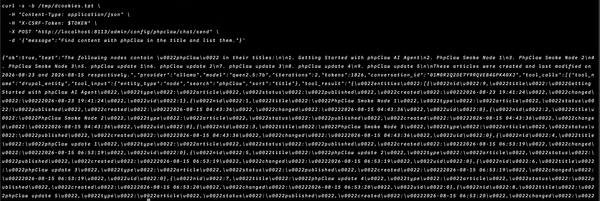

<p align="center">
    
    
</p>

<p align="center">
<a href="https://www.php.net"></a>
<a href="https://www.drupal.org"></a>
<a href="LICENSE"></a>
<a href="https://github.com/phpclaw-php/phpclaw-monorepo/actions/workflows/drupal.yml"></a>
<a href="https://packagist.org/packages/phpclaw/phpclaw-drupal"></a>
<a href="https://packagist.org/packages/phpclaw/phpclaw-drupal"></a>
</p>

> **This is a read-only mirror**, auto-published from [`phpclaw-monorepo`](https://github.com/phpclaw-php/phpclaw-monorepo). Please open issues and pull requests there, not here.

<h1 align="center">Talk to your Drupal site.</h1>
<p align="center">phpClaw is the AI layer for Drupal.</p>

---

Running a site means digging through content, config, and the Drush toolbox to answer questions that should take five seconds. phpClaw replaces the digging with a conversation, backed by Drupal-aware tools.

Ask about content, users, blocks, or your cron status and get a real answer. No custom query, no admin-screen archaeology.

Same agent, five ways in: the admin chat, Drush, the REST API, the module's own admin routes, or your own PHP code via dependency injection.

## Just ask

```
> Show me unpublished nodes older than 30 days
> Which modules need updating?
> Is cron running on schedule?
> Read today's watchdog log
```

## Drupal Admin



A chat panel inside **Configuration → phpClaw AI Agent → Chat**. Ask a question, the agent picks a tool, runs it against your site, and answers in the same panel.

## Drush



The same agent from your terminal, scriptable and CI-friendly:

```bash
drush phpclaw:run "show unpublished nodes"
drush pc "check module updates" --stream
```

## REST API



Two routes on Drupal's own routing and authentication stack. Drupal authenticates the caller and
checks the permission before phpClaw runs, and phpClaw issues no token of its own.

```
POST /api/phpclaw/send                    synchronous agent run
POST /api/phpclaw/chat/stream             SSE streaming chat
```

Both require `use phpclaw chat`. Conversations are stamped with the calling user's ID and scoped to
that user unless they also hold `manage all phpclaw conversations`.

Drupal core ships two authentication providers, `cookie` and `basic_auth`, and issues no per-user
API token. The routes accept whichever providers `api_auth_providers` lists, defaulting to
`basic_auth` and `cookie`. Add a contributed provider ID there if the site runs one.

```bash
drush en basic_auth

curl -u 'USERNAME:PASSWORD' \
  -X POST https://example.com/api/phpclaw/send \
  -H 'Content-Type: application/json' \
  -d '{"message": "how many articles are published?"}'
```

Basic authentication sends the account password on every request, so serve these routes over HTTPS.
Drupal requires an `X-CSRF-Token` header only when a request carries a session cookie, so a
basic-auth caller needs none.

## Admin routes

The admin screens keep their own routes under `/admin/config/phpclaw/*`, including chat send,
stream, load and delete, plus the administrator-only provider test-connection. Those run inside an
authenticated Drupal session with an `X-CSRF-Token` header and are not part of the REST surface.

## Programmatic use

Resolved straight from Drupal's service container, where `PhpClawServiceFactory` is the factory behind `phpclaw.agent`:

```php
$phpclaw = \Drupal::service('phpclaw.agent');
$response = $phpclaw->send('Summarise unpublished content.');
echo $response->text;
```

## Installation

1. `composer require phpclaw/phpclaw-drupal`. This also installs `phpclaw/phpclaw-cloud` and `phpclaw/phpclaw-mcp` as required dependencies (cloud guards/webhooks and the MCP server are both optional to use; no cloud account is needed to run the module locally).
2. Enable the module: `drush en phpclaw -y`
3. Open **Configuration → phpClaw AI Agent → Settings**, pick a provider, and add your API key.

Full setup, configuration, and provider options are documented at [phpclaw.ai/docs/adapters/drupal](https://phpclaw.ai/docs/adapters/drupal).

## Key features

✅ **Natural language**: ask in plain English, no query syntax to learn

✅ **15 Drupal-native tools + 7 core utility tools (22 total)**: entities, config, database, log, modules, cron, menus, media, views, user roles, blocks, path aliases, cache, content moderation, webforms. The log tool reads Drupal's `watchdog` table, so it needs the core `dblog` module enabled.

✅ **Admin chat**: inside the Drupal back-end, where your team already works

✅ **Drush CLI**: the same agent, scriptable and CI-friendly, plus an `mcp-server` command

✅ **Multiple AI providers**: Anthropic, OpenAI, Groq, Gemini, Mistral, DeepSeek, Ollama, and any custom OpenAI-compatible endpoint

✅ **Admin routes**: the same send and stream backend the Chat page uses, callable from admin-side code

✅ **Conversation memory**: context carries across a session

### How it fits together

```
Drupal → phpClaw module (PhpClawRegistrar + PhpClawServiceFactory) → phpClaw agent runtime → your configured AI provider
```

## Documentation

This README gets you installed. Everything else (configuration, providers, memory, skills, Cloud, the full tool reference, admin routes, CLI, code examples, upgrading, troubleshooting) lives at:

**[phpclaw.ai/docs/adapters/drupal](https://phpclaw.ai/docs/adapters/drupal)**

## Contributing

Contributions are welcome. See the [contributing guide](https://phpclaw.ai/docs/contributing).

## Security

Please review our [security policy](https://github.com/phpclaw-php/phpclaw-monorepo/security/policy) for reporting vulnerabilities.

## License

MIT. See [LICENSE](LICENSE). Part of the [phpClaw](https://github.com/phpclaw-php/phpclaw-monorepo) project.

Drupal is a registered trademark of Dries Buytaert. phpClaw is an independent open-source project and is not affiliated with or endorsed by the Drupal Association.
