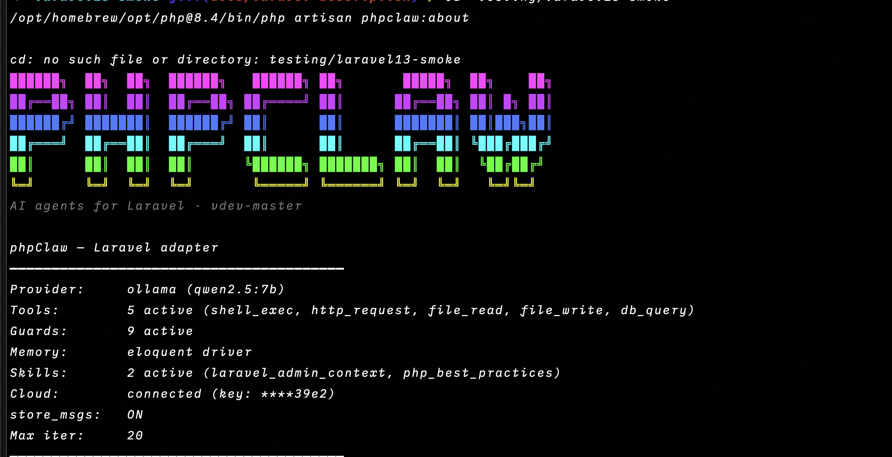
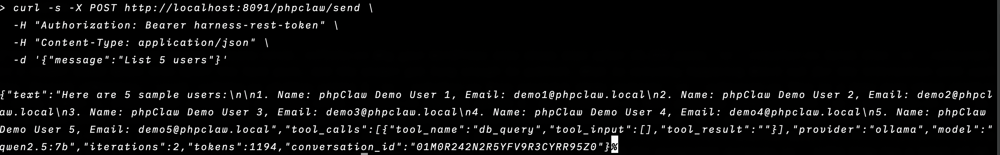

<p align="center">
    
    
</p>

<p align="center">
<a href="https://www.php.net"></a>
<a href="https://laravel.com"></a>
<a href="LICENSE"></a>
<a href="https://packagist.org/packages/phpclaw/phpclaw-laravel"></a>
<a href="https://github.com/phpclaw-php/phpclaw-monorepo/actions/workflows/laravel.yml"></a>
<a href="https://packagist.org/packages/phpclaw/phpclaw-laravel"></a>
</p>

> **This is a read-only mirror**, auto-published from [`phpclaw-monorepo`](https://github.com/phpclaw-php/phpclaw-monorepo). Please open issues and pull requests there, not here.

<h1 align="center">Give your Laravel app an agent, not a chatbot.</h1>
<p align="center">An agent engine with tools, guards and memory, native to Artisan, DI and queues. Laravel 10 to 13, PHP 8.1+.</p>

---

Most "AI in Laravel" setups mean gluing an HTTP client to your app and hoping the prompt holds up. phpClaw is a real dependency: autowired via the container, driven by Artisan, backed by your database, with tools that actually query your application instead of guessing.

Ask it something and it picks a tool, runs it against your live app, and answers with real data. No fine-tuning, no separate service to run.

## Just ask

```
> How many users signed up this week?
> Show me the last 20 failed jobs
> What's in the cache under the "settings" key?
> List all registered API routes
> Summarise today's error log
```

## CLI



The agent from your terminal, scriptable and CI-friendly:

```bash
php artisan phpclaw "how many users signed up this week?"
php artisan phpclaw "check queue health" --stream
```

## Programmatic use

Autowired via the container. Inject `ClawInterface` anywhere:

```php
use PhpClaw\Contracts\ClawInterface;

class DashboardController
{
    public function __construct(private readonly ClawInterface $phpclaw) {}

    public function summary()
    {
        return $this->phpclaw->send('Summarise this week\'s signups.')->text;
    }
}
```

## REST API



Enabled by default (`phpclaw.api.enabled`, from `PHPCLAW_API_ENABLED`, which defaults to `true`); set it to `false` to close both routes. Two routes, under a configurable prefix (default `/phpclaw`):

```
POST /phpclaw/send                          synchronous agent run
POST /phpclaw/chat/stream                   streamed response
```

Both require an authenticated user: every conversation is stored against `auth()->id()`, and a
caller only ever reaches their own conversations. Point `phpclaw.api.middleware` at the guard your
app authenticates API callers with. Two things grant cross-user access, and both are off by
default: the `phpclaw.manage-all` Gate ability, which denies unless your app defines it, and the
`PHPCLAW_ADMIN_IDS` env list, whose user IDs bypass the Gate entirely.

## Installation

```bash
composer require phpclaw/phpclaw-laravel
```

Set one provider key in `.env` (e.g. `ANTHROPIC_API_KEY=sk-ant-…`), then run your first agent:

```bash
php artisan phpclaw "how many users signed up this week?"
```

Full setup, configuration, and provider options are documented at [phpclaw.ai/docs/adapters/laravel](https://phpclaw.ai/docs/adapters/laravel).

## Key features

✅ **Native Artisan CLI**: `phpclaw`, `phpclaw:mcp-server`, `phpclaw:about`, `phpclaw:guide`, `phpclaw:stats`, `phpclaw:jobs:list`, `phpclaw:jobs:status`

✅ **Database-backed memory**: conversation + key-value drivers via the query builder, plus a cache-store driver

✅ **6 Laravel-native tools**: database (read-only SELECT), log tail, route list, config read, cache inspect, queue status

✅ **Telescope integration**: every agent run, tool call, and guard block recorded for local debugging (auto-detected, off if Telescope isn't installed)

✅ **REST API**: on by default behind your API middleware, two endpoints: `send` and `chat/stream`. Set `PHPCLAW_API_ENABLED=false` to close them

✅ **Multiple AI providers**: Anthropic, OpenAI, Groq, Gemini, Mistral, DeepSeek, Ollama, and any custom OpenAI-compatible endpoint

✅ **Conversation memory**: context carries across a session by default

### How it fits together

```
Laravel → phpClaw Laravel adapter (PhpClawServiceProvider) → phpClaw agent runtime → your configured AI provider
```

## Documentation

This README gets you installed. Everything else (configuration, providers, memory, skills, Cloud, the full tool reference, REST API, CLI, code examples, upgrading, troubleshooting) lives at:

**[phpclaw.ai/docs/adapters/laravel](https://phpclaw.ai/docs/adapters/laravel)**

## Contributing

Contributions are welcome. See the [contributing guide](https://phpclaw.ai/docs/contributing).

## Security

Please review our [security policy](https://github.com/phpclaw-php/phpclaw-monorepo/security/policy) for reporting vulnerabilities.

## License

MIT. See [LICENSE](LICENSE). Part of the [phpClaw](https://github.com/phpclaw-php/phpclaw-monorepo) project.

Laravel is a trademark of Laravel Holdings Inc. phpClaw is an independent open-source project and is not affiliated with or endorsed by Laravel Holdings Inc.
