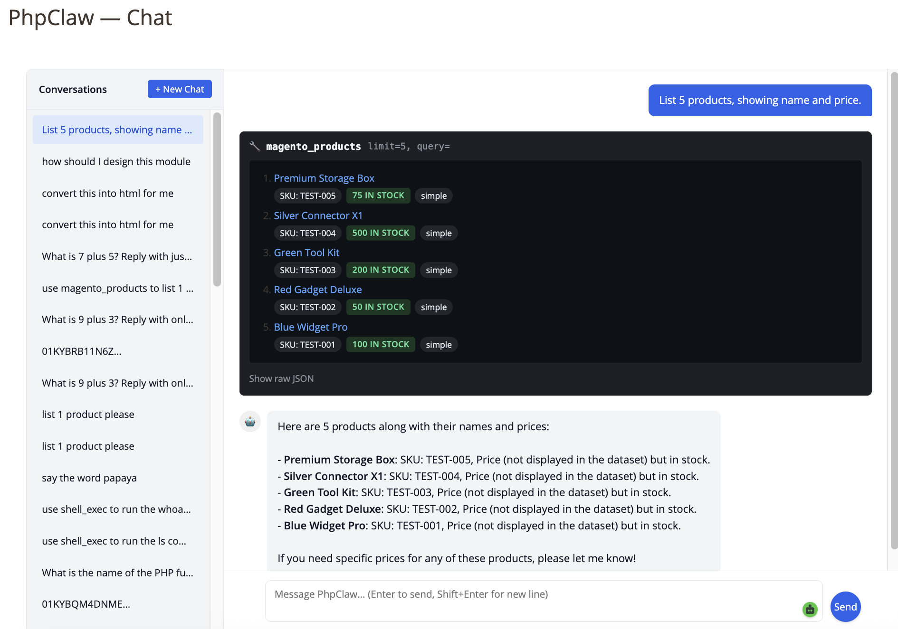
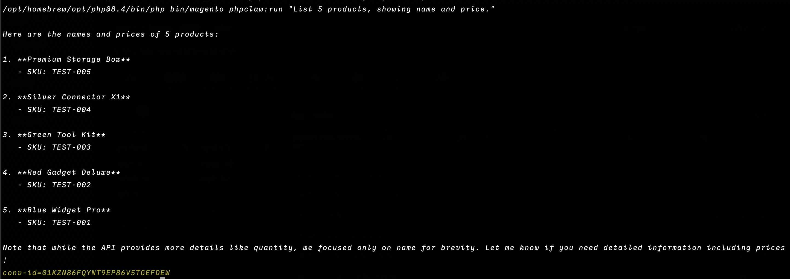
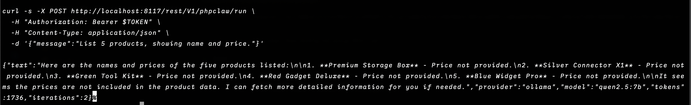

<p align="center">
    
    
</p>

<p align="center">
<a href="https://www.php.net"></a>
<a href="https://magento.com"></a>
<a href="LICENSE"></a>
<a href="https://packagist.org/packages/phpclaw/phpclaw-magento"></a>
<a href="https://github.com/phpclaw-php/phpclaw-monorepo/actions/workflows/magento.yml"></a>
<a href="https://packagist.org/packages/phpclaw/phpclaw-magento"></a>
</p>

> **This is a read-only mirror**, auto-published from [`phpclaw-monorepo`](https://github.com/phpclaw-php/phpclaw-monorepo). Please open issues and pull requests there, not here.

<h1 align="center">Talk to your Magento store.</h1>
<p align="center">phpClaw is the AI layer for Magento 2 and Adobe Commerce.</p>

---

Running a Magento store means living in Sales, Reports, and Catalog to answer questions that should take five seconds. phpClaw replaces the clicking with a conversation, backed by Magento-aware tools.

Ask about orders, inventory, or yesterday's revenue and get a real answer, pulled from your live store. No SQL, no custom script, no digging through nested grids.

Same agent, three ways in: the Admin panel, your terminal, or your own app over REST.

## Just ask

```
> Show today's failed orders
> Which products are low in stock?
> Show yesterday's revenue
> Read today's exception.log
> Show orders from the last 7 days with status "pending"
```

## Magento Admin



A chat panel inside Magento admin, next to Sales and Catalog. Ask a question, the agent picks a tool, runs it against your store, and answers in the same panel. No new tab, no separate app to learn.

## CLI Experience



The same agent from your terminal, scriptable and CI-friendly:

```bash
bin/magento phpclaw:run "show today's failed orders"
bin/magento phpclaw:run "check order-queue status" --stream
bin/magento phpclaw:mcp-server
```

The console runs outside an admin session, so conversations it creates are stored with owner
`0` and are visible only to roles holding `PhpClaw_Magento::phpclaw_settings`.

## REST API



Bring phpClaw into your own tools. Two routes, both requiring a Magento admin bearer token:

```
POST /V1/phpclaw/send                        synchronous agent execution
POST /V1/phpclaw/chat/stream                SSE streaming chat
```

Both require the `PhpClaw_Magento::phpclaw_chat` ACL resource and are scoped to the caller's
own conversations unless the caller also holds `PhpClaw_Magento::phpclaw_settings`. Provider
test-connection is an admin-panel action requiring that same `PhpClaw_Magento::phpclaw_settings`
resource, and is not exposed over REST.

## Installation

```bash
composer require phpclaw/phpclaw-magento
bin/magento module:enable PhpClaw_Magento
bin/magento setup:upgrade
bin/magento setup:di:compile
bin/magento cache:flush
```

Full setup, configuration, and provider options are documented at [phpclaw.ai/docs/adapters/magento](https://phpclaw.ai/docs/adapters/magento).

## Key features

✅ **Natural language**: ask in plain English, no query syntax to learn

✅ **10 Magento-native tools**: orders, products, customers, inventory, categories, stores, reports, cache, plus read-only database and log access

✅ **Cache diagnostics**: read-only cache-type status, each type with its label and current state (enabled, disabled, invalidated); it never flushes or clears a cache

✅ **Admin interface**: a chat panel inside Magento, where your team already works

✅ **CLI**: the same agent, scriptable and CI-friendly, plus an `mcp-server` command

✅ **REST API**: bring phpClaw into your own tools and dashboards

✅ **Multiple AI providers**: Anthropic, OpenAI, Groq, Gemini, Mistral, DeepSeek, Ollama, and any custom OpenAI-compatible endpoint

✅ **Conversation memory**: context carries across a session

### How it fits together

```
Magento → phpClaw Magento adapter → phpClaw agent runtime → your configured AI provider
```

## Documentation

This README gets you installed. Everything else (configuration, providers, memory, skills, Cloud, the full tool reference, REST API, CLI, code examples, upgrading, troubleshooting) lives at:

**[phpclaw.ai/docs/adapters/magento](https://phpclaw.ai/docs/adapters/magento)**

## Contributing

Contributions are welcome. See the [contributing guide](https://phpclaw.ai/docs/contributing).

## Security

Please review our [security policy](https://github.com/phpclaw-php/phpclaw-monorepo/security/policy) for reporting vulnerabilities.

## License

MIT. See [LICENSE](LICENSE). Part of the [phpClaw](https://github.com/phpclaw-php/phpclaw-monorepo) project.

Magento and Adobe Commerce are trademarks of Adobe Inc. phpClaw is an independent open-source project and is not affiliated with or endorsed by Adobe.
