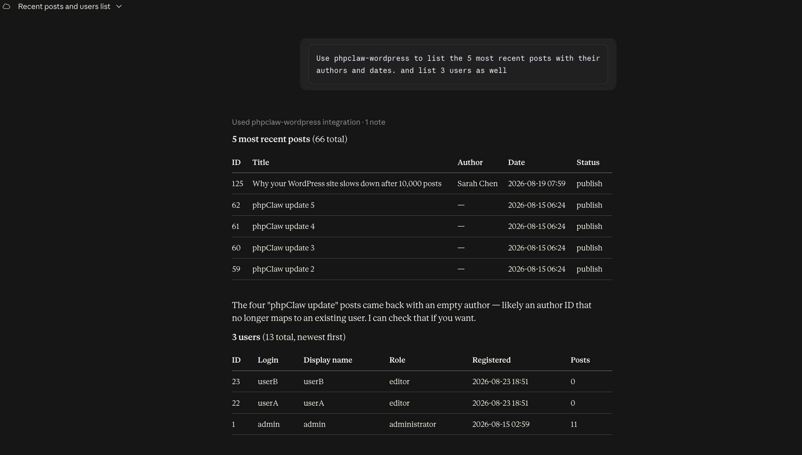

<p align="center">
    
    
</p>

<p align="center">
<a href="https://www.php.net"></a>
<a href="LICENSE"></a>
<a href="https://github.com/phpclaw-php/phpclaw-monorepo/actions/workflows/mcp.yml"></a>
<a href="https://packagist.org/packages/phpclaw/phpclaw-mcp"></a>
<a href="https://packagist.org/packages/phpclaw/phpclaw-mcp"></a>
</p>

> **This is a read-only mirror**, auto-published from [`phpclaw-monorepo`](https://github.com/phpclaw-php/phpclaw-monorepo). Please open issues and pull requests there, not here.

<h1 align="center">Expose any phpClaw app as an MCP server.</h1>
<p align="center">Your existing ToolRegistry, over JSON-RPC 2.0, zero changes to your tools.</p>

---

Connect Claude Desktop, Claude Code, Cursor, Windsurf, or Zed directly to your PHP tools. phpClaw MCP wraps whatever `ToolRegistry` you've already built and speaks the Model Context Protocol on top of it.

Writing a raw MCP server from scratch means implementing JSON-RPC framing, transports, auth, and rate limiting yourself, on top of re-solving the exact prompt-injection problem phpClaw's guards already solve. This package is that work, done once.

## Quick start

```bash
composer require phpclaw/phpclaw-mcp
```

Create a stdio server entry script (`mcp-server.php`): register your tools, then hand the registry to `CliRunner`:

```php
<?php
require 'vendor/autoload.php';

use PhpClaw\Mcp\Generic\CliRunner;
use PhpClaw\Tools\ToolRegistry;

$registry = new ToolRegistry();
$registry->register([/* your tools */]);

CliRunner::run($registry);
```

Run `php mcp-server.php`, or add it to your client's MCP config (Claude Code, Cursor, Windsurf):

```json
{
  "mcpServers": {
    "phpclaw": {
      "command": "php",
      "args": ["mcp-server.php"]
    }
  }
}
```



## Key features

✅ **2 transports**: `stdio` (Claude Code, Cursor, Windsurf, Zed) and `StreamableHttpTransport` (the current MCP HTTP spec)

✅ **Full guard chain applies**: every call runs through the same default guard chain as any other phpClaw agent (prompt-injection, Unicode, homoglyph, role-switch, code-injection, destructive-SQL, PII and length checks), via `GuardRegistry::registerDefaults()`

✅ **ShellTool allowlist and FileReadTool / FileWriteTool sandbox**: unchanged from core, enforced on every MCP call exactly as they would be on a direct call

✅ **Bearer-token auth**: `PHPCLAW_MCP_TOKEN` gates the HTTP transport with a timing-safe comparison, and the transport refuses to start when it is unset

✅ **Built-in rate limiting**: 60 requests/minute by default, shared across processes via APCu when available

✅ **Zero framework dependencies**: pure PHP, same `php ^8.1` floor as core

### How it fits together

```
MCP client (Claude Desktop / Code / Cursor) → phpclaw-mcp server → your ToolRegistry → the same guards and tools as any other phpClaw agent
```

## Documentation

This README gets you installed. Everything else (the full transport reference, security model, self-hosting, code examples) lives at:

**[phpclaw.ai/docs/mcp](https://phpclaw.ai/docs/mcp)**

## Contributing

Contributions are welcome. See the [contributing guide](https://phpclaw.ai/docs/contributing).

## Security

Please review our [security policy](https://github.com/phpclaw-php/phpclaw-monorepo/security/policy) for reporting vulnerabilities.

## License

MIT. See [LICENSE](LICENSE). Part of the [phpClaw](https://github.com/phpclaw-php/phpclaw-monorepo) project.
