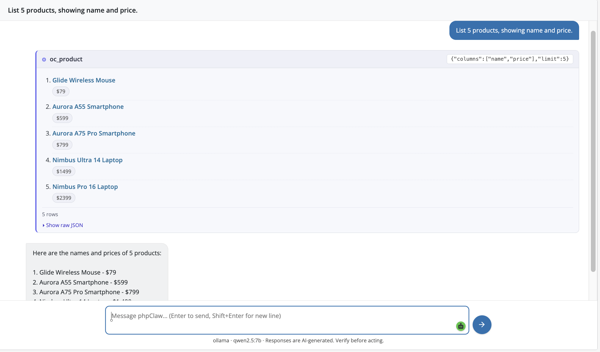
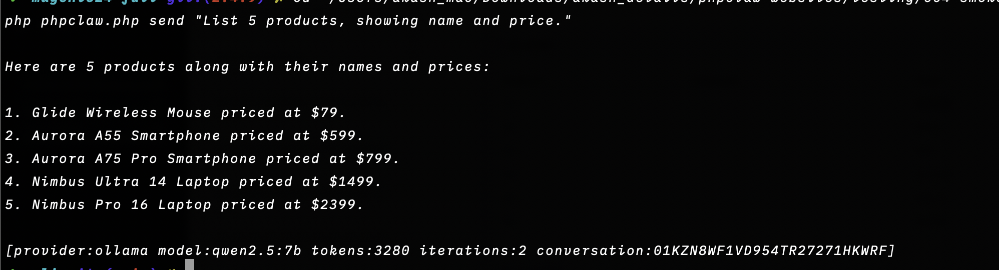
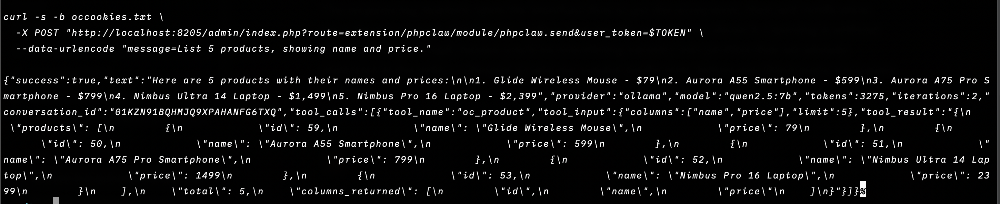

<p align="center">
    
    
</p>

<p align="center">
<a href="https://www.php.net"></a>
<a href="https://www.opencart.com"></a>
<a href="LICENSE"></a>
<a href="https://github.com/phpclaw-php/phpclaw-monorepo/actions/workflows/opencart.yml"></a>
<a href="https://github.com/phpclaw-php/phpclaw-monorepo/releases"></a>
<a href="https://github.com/phpclaw-php/phpclaw-monorepo/releases"></a>
</p>

<h1 align="center">Talk to your OpenCart store.</h1>
<p align="center">phpClaw is the AI layer for OpenCart 3 and 4.</p>

---

Running a store means digging through Products, Orders, and Customers to answer questions that should take five seconds. phpClaw replaces the digging with a conversation, backed by OpenCart-aware tools.

Ask about products, orders, customers, or stock and get a real answer, pulled from your live store. No custom query, no admin-screen archaeology.

Same agent, three ways in: the admin chat, the CLI, or the store's own admin routes, and it's the identical experience on OC3 and OC4.

## Just ask

```
> Show me low-stock products
> List orders from the last 7 days
> Which coupons are expiring soon?
> Read today's error log
```

## OpenCart Admin



A chat panel inside the admin, reached from **Extensions → Extensions → Modules → phpClaw**. Identical UI on OC3 and OC4. Both ship the full 5-page set (Settings, Chat, Analytics, Guide, About).

## CLI Experience



The same agent from your terminal, scriptable and CI-friendly. The same script ships on **both** OC3 and OC4:

```bash
php cli/phpclaw.php send "show low-stock products"
php cli/phpclaw.php send "check order status" --stream
php cli/phpclaw.php mcp-server
```

## REST-style API



No versioned REST API. Endpoints are plain OpenCart admin controller routes, so every call needs
an authenticated admin session and a `user_token`:

```
index.php?route=extension/module/phpclaw/send             OC3: synchronous agent run
index.php?route=extension/phpclaw/module/phpclaw.send     OC4: synchronous agent run
index.php?route=extension/module/phpclaw/stream           OC3: SSE streaming chat
index.php?route=extension/phpclaw/module/phpclaw.stream   OC4: SSE streaming chat
```

Both are scoped to the caller's own conversations unless their group holds the `manage_all`
permission. Provider test-connection requires that same `manage_all` permission, which the
installer grants to the user group that installs the module.

The CLI ships exactly two subcommands, `send` and `mcp-server`. A conversation created from the
CLI is stored with `owner_id = 0`, so only holders of `manage_all` can see it.

## Installation

1. Download the ZIP for your OpenCart version from [Releases](https://github.com/phpclaw-php/phpclaw-monorepo/releases):
   `phpclaw-opencart3-<version>.ocmod.zip` for OpenCart 3.x, `phpclaw-opencart4-<version>.ocmod.zip` for OpenCart 4.x.
2. **Extensions → Installer** and upload that ZIP.
3. **Extensions → Extensions → Modules**, install "phpClaw AI Agent", then set your provider and API key.

Full setup, configuration, and provider options are documented at [phpclaw.ai/docs/adapters/opencart](https://phpclaw.ai/docs/adapters/opencart).

## Key features

✅ **Natural language**: ask in plain English, no query syntax to learn

✅ **10 OpenCart-native tools**: products, orders, customers, categories, manufacturers, reviews, coupons, shipping, plus read-only database and log access

✅ **Admin chat**: inside the OpenCart admin, identical on OC3 and OC4

✅ **CLI**: the same agent, scriptable and CI-friendly, on both OC3 and OC4, plus an `mcp-server` subcommand

✅ **Multiple AI providers**: Anthropic, OpenAI, Groq, Gemini, Mistral, DeepSeek, Ollama, and any custom OpenAI-compatible endpoint

✅ **Conversation memory**: context carries across a session

### How it fits together

```
OpenCart → phpClaw extension (dual OC3/OC4 upload trees, shared src/) → phpClaw agent runtime → your configured AI provider
```

## Documentation

This README gets you installed. Everything else (configuration, providers, memory, skills, Cloud, the full tool reference, admin routes, CLI, code examples, upgrading, troubleshooting) lives at:

**[phpclaw.ai/docs/adapters/opencart](https://phpclaw.ai/docs/adapters/opencart)**

## Contributing

Contributions are welcome. See the [contributing guide](https://phpclaw.ai/docs/contributing).

## Security

Please review our [security policy](https://github.com/phpclaw-php/phpclaw-monorepo/security/policy) for reporting vulnerabilities.

## License

MIT. See [LICENSE](LICENSE). Part of the [phpClaw](https://github.com/phpclaw-php/phpclaw-monorepo) project.

OpenCart is a trademark of OpenCart Limited. phpClaw is an independent open-source project and is not affiliated with or endorsed by OpenCart Limited.
