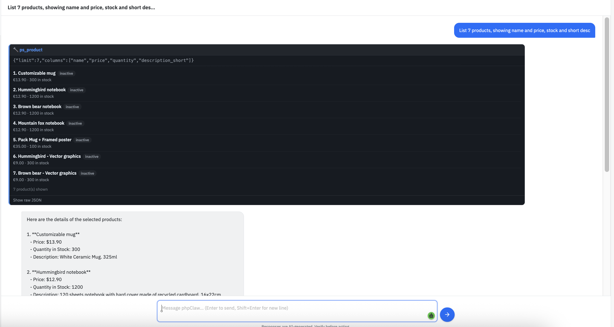
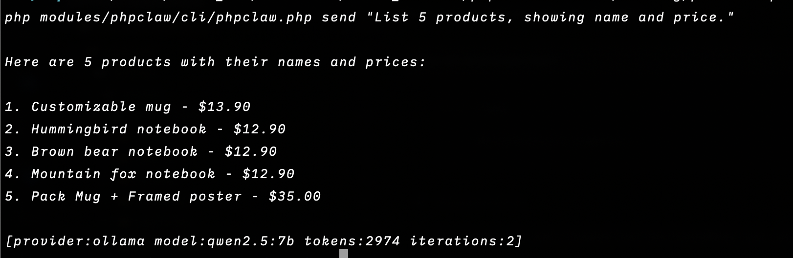
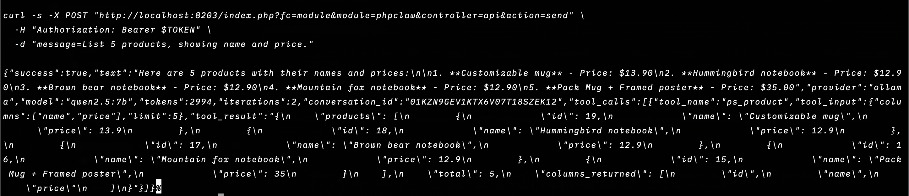

<p align="center">
    
    
</p>

<p align="center">
<a href="https://www.php.net"></a>
<a href="https://www.prestashop.com"></a>
<a href="LICENSE"></a>
<a href="https://github.com/phpclaw-php/phpclaw-monorepo/actions/workflows/prestashop.yml"></a>
<a href="https://github.com/phpclaw-php/phpclaw-monorepo/releases"></a>
<a href="https://github.com/phpclaw-php/phpclaw-monorepo/releases"></a>
</p>

<h1 align="center">Talk to your PrestaShop store.</h1>
<p align="center">phpClaw is the AI layer for PrestaShop 8 and 9.</p>

---

Running a store means digging through Products, Orders, and Customers to answer questions that should take five seconds. phpClaw replaces the digging with a conversation, backed by PrestaShop-aware tools.

Ask about products, orders, customers, or stock and get a real answer, pulled from your live store. No custom query, no back-office archaeology.

Same agent, three ways in: the back-office chat, CLI, or your own app over a REST-style module endpoint.

## Just ask

```
> Show me low-stock products
> List orders from the last 7 days
> Which cart rules are expiring soon?
> Read today's error log
```

## PrestaShop Admin



A chat panel inside the back-office, reached from **phpClaw → Chat**. Ask a question, the agent picks a tool, runs it against your store, and answers in the same panel.

## CLI Experience



The same agent from your terminal, scriptable and CI-friendly:

```bash
php modules/phpclaw/cli/phpclaw.php send "show low-stock products"
php modules/phpclaw/cli/phpclaw.php send "check order status" --stream
```

## REST-style API



A single front controller, action-dispatched via `?action=`. Two actions, both requiring a Bearer
token or an active Back Office session:

```
{shop_url}/index.php?fc=module&module=phpclaw&controller=api&action=send                        synchronous agent run
...&action=chat/stream                                                                            SSE streaming chat
```

Both are scoped to the caller's own conversations unless the acting employee holds the manage-all
grant. Provider test-connection is a Back Office action only.

A session-authenticated caller must also hold the phpClaw chat permission: authenticating as an
employee is not on its own enough to drive the agent.

## Installation

1. Download the latest `phpclaw-prestashop-<version>.zip` from [Releases](https://github.com/phpclaw-php/phpclaw-monorepo/releases).
2. **Modules → Module Manager → Upload a module**, upload the ZIP, and click **Install**.
3. Open **phpClaw → Settings**, pick a provider, enter your API key, and click **Test Connection**.

Full setup, configuration, and provider options are documented at [phpclaw.ai/docs/adapters/prestashop](https://phpclaw.ai/docs/adapters/prestashop).

## Key features

✅ **Natural language**: ask in plain English, no query syntax to learn

✅ **14 PrestaShop-native tools**: products, orders, customers, categories, manufacturers, carts, stock, coupons, modules, reports, configuration, employees, plus read-only database and log access

✅ **Back-office chat**: inside PrestaShop, where your team already works

✅ **CLI**: the same agent, scriptable and CI-friendly, plus an `mcp-server` subcommand

✅ **Native memory drivers**: conversations persist through PrestaShop's own database layer (`ps_router`, `ps_setting`, `ps_db`), or a portable JSON-file driver (`file`) shared with every phpClaw adapter

✅ **Multiple AI providers**: Anthropic, OpenAI, Groq, Gemini, Mistral, DeepSeek, Ollama, and any custom OpenAI-compatible endpoint

✅ **Conversation memory**: context carries across a session

### How it fits together

```
PrestaShop → phpClaw module (Plugin singleton + EngineFactory) → phpClaw agent runtime → your configured AI provider
```

## Documentation

This README gets you installed. Everything else (configuration, providers, memory, skills, Cloud, the full tool reference, API, CLI, code examples, upgrading, troubleshooting) lives at:

**[phpclaw.ai/docs/adapters/prestashop](https://phpclaw.ai/docs/adapters/prestashop)**

## Contributing

Contributions are welcome. See the [contributing guide](https://phpclaw.ai/docs/contributing).

## Security

Please review our [security policy](https://github.com/phpclaw-php/phpclaw-monorepo/security/policy) for reporting vulnerabilities.

## License

MIT. See [LICENSE](LICENSE). Part of the [phpClaw](https://github.com/phpclaw-php/phpclaw-monorepo) project.

PrestaShop is a registered trademark of PrestaShop SA. phpClaw is an independent open-source project and is not affiliated with or endorsed by PrestaShop SA.
