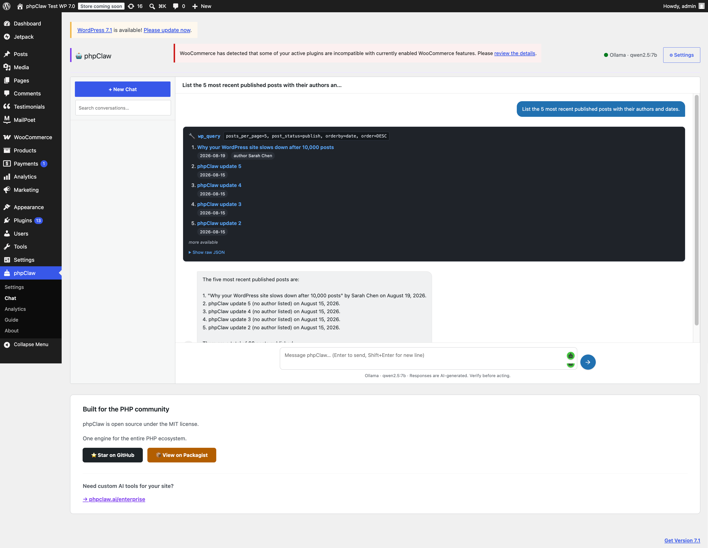
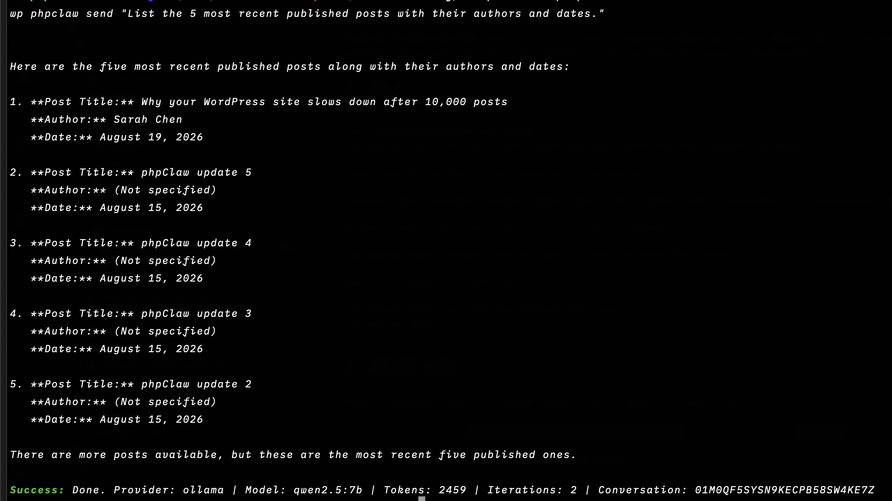
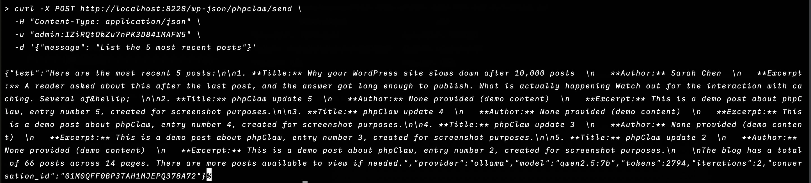

<p align="center">
    
    
</p>

<p align="center">
<a href="https://www.php.net"></a>
<a href="https://wordpress.org"></a>
<a href="LICENSE"></a>
<a href="https://github.com/phpclaw-php/phpclaw-monorepo/actions/workflows/wordpress.yml"></a>
<a href="https://github.com/phpclaw-php/phpclaw-monorepo/releases"></a>
<a href="https://github.com/phpclaw-php/phpclaw-monorepo/releases"></a>
</p>

<h1 align="center">Talk to your WordPress site.</h1>
<p align="center">phpClaw is the AI layer for WordPress and WooCommerce.</p>

---

Running a site means digging through Posts, Users, Plugins, and Comments to answer questions that should take five seconds. phpClaw replaces the digging with a conversation, backed by WordPress-aware tools.

Ask about posts, users, plugins, or last week's orders and get a real answer, pulled from your live site. No custom query, no admin-screen archaeology.

Same agent, three ways in: the admin chat, WP-CLI, or your own app over REST.

## Just ask

```
> Show me draft posts older than 30 days
> Which plugins need updating?
> List comments awaiting moderation
> Read today's error log
> Show WooCommerce orders from the last 7 days
```

## WordPress Admin



A chat panel inside `wp-admin`, next to Posts and Plugins. Ask a question, the agent picks a tool, runs it against your site, and answers in the same panel.

## CLI Experience



The same agent from your terminal, scriptable and CI-friendly:

```bash
wp phpclaw send "show today's failed orders"
wp phpclaw send "check plugin update status" --stream
```

## REST API



Two routes under `/wp-json/phpclaw/*`:

```
POST /wp-json/phpclaw/send                             synchronous agent run
POST /wp-json/phpclaw/chat/stream                       SSE streaming chat
```

Both require the `phpclaw_use_chat` capability and are scoped to the caller's own conversations
unless the caller holds `phpclaw_manage_all_conversations`.

Test Connection runs on the wp-admin transport rather than REST, and stays administrator-only.
Loading a conversation sits on the same chat tier as these two routes: any chat-tier user can open
their own, and requesting someone else's returns `403`.

## Installation

1. Download the latest release ZIP from [Releases](https://github.com/phpclaw-php/phpclaw-monorepo/releases).
2. **Plugins → Add New → Upload Plugin**, upload the ZIP, and click **Activate**.
3. Open **phpClaw → Settings**, pick a provider, and add your API key.

Full setup, configuration, and provider options are documented at [phpclaw.ai/docs/adapters/wordpress](https://phpclaw.ai/docs/adapters/wordpress).

## Key features

✅ **Natural language**: ask in plain English, no query syntax to learn

✅ **11 WordPress-native tools + 10 WooCommerce tools**: posts/pages, users, options, database, plugins, taxonomy, comments, media, menus, cron, logs. Plus products, orders, customers, coupons, reports, stock, shipping, tax, categories, reviews when WooCommerce is active

✅ **Admin chat**: inside `wp-admin`, where your team already works

✅ **WP-CLI**: the same agent, scriptable and CI-friendly, plus an `mcp-server` command

✅ **REST API**: bring phpClaw into your own tools and dashboards

✅ **Multiple AI providers**: Anthropic, OpenAI, Groq, Gemini, Mistral, DeepSeek, Ollama, and any custom OpenAI-compatible endpoint

✅ **Conversation memory**: context carries across a session

### How it fits together

```
WordPress → phpClaw plugin (Plugin.php) → phpClaw agent runtime → your configured AI provider
```

## Documentation

This README gets you installed. Everything else (configuration, providers, memory, skills, Cloud, the full tool reference, REST API, CLI, code examples, upgrading, troubleshooting) lives at:

**[phpclaw.ai/docs/adapters/wordpress](https://phpclaw.ai/docs/adapters/wordpress)**

## Contributing

Contributions are welcome. See the [contributing guide](https://phpclaw.ai/docs/contributing).

## Security

Please review our [security policy](https://github.com/phpclaw-php/phpclaw-monorepo/security/policy) for reporting vulnerabilities.

## License

MIT. See [LICENSE](LICENSE). Part of the [phpClaw](https://github.com/phpclaw-php/phpclaw-monorepo) project.

WordPress is a trademark of the WordPress Foundation. WooCommerce and its associated designs are trademarks of Automattic Inc. phpClaw is an independent open-source project and is not affiliated with or endorsed by the WordPress Foundation or Automattic.
